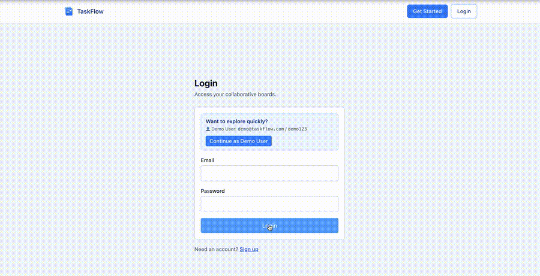
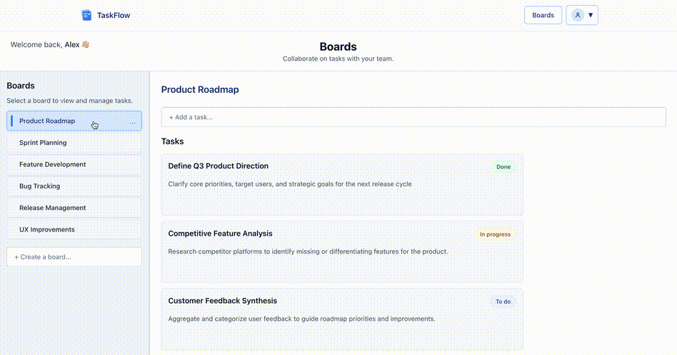
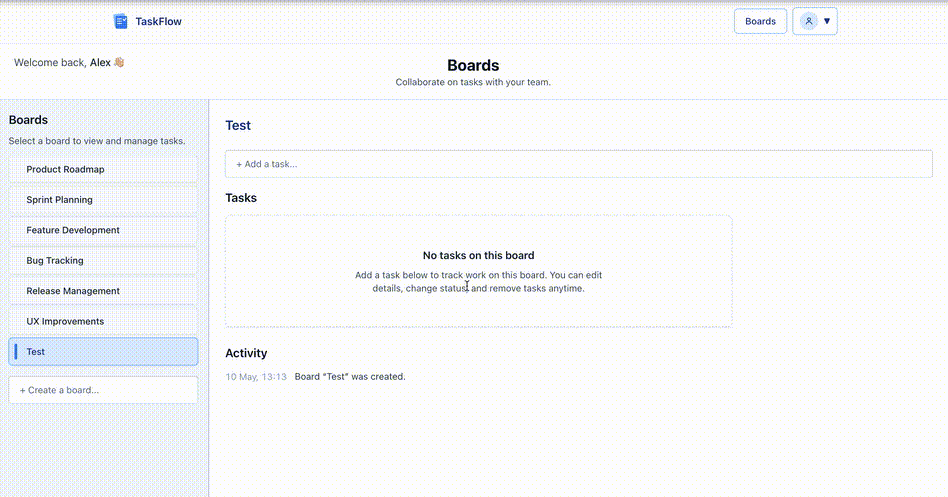
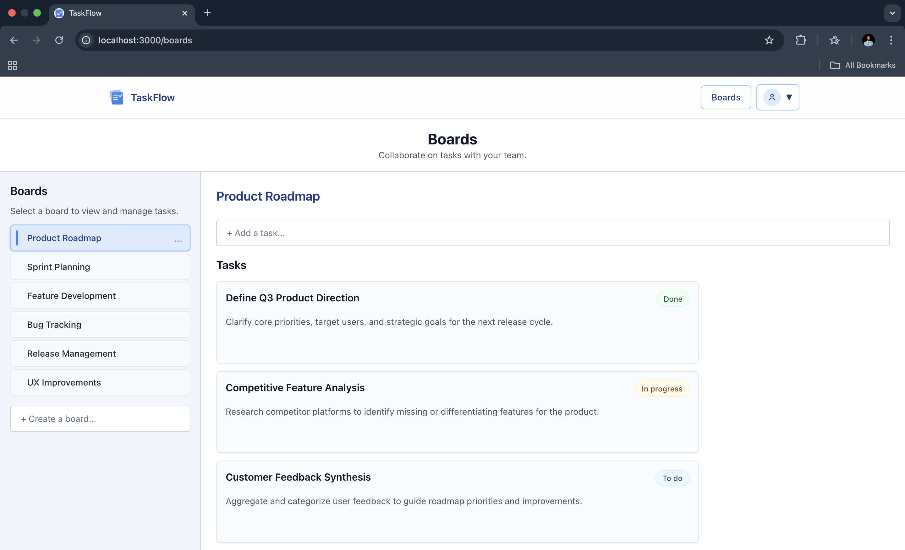

# TaskFlow

A real-time task management application with secure authentication, row-level security, and live updates. Built with a focus on clean UX and production-level architecture.

## Live Demo

https://taskflow-rust-one.vercel.app/

**Demo Account**

`demo@taskflow.com` / `demo123`

---

## Features

- Secure authentication with server-side session handling
- Row-level security (RLS) to isolate user data
- Boards and tasks CRUD with inline editing
- Smooth UX with inline task creation and minimal friction flows
- Toast notifications, loading states, and error handling
- Responsive layout with sidebar navigation

---

## Tech Stack

- Next.js 14 (App Router)
- TypeScript
- Supabase (Auth, Database, Realtime)
- Tailwind CSS

---

## Key Implementation Details

- Implemented **server-side route protection** using Supabase SSR and cookie-based sessions
- Designed database access with **row-level security (RLS)** to ensure users only access their own data
- Focused on **UX improvements** such as inline creation, hover actions, and reduced visual noise
- Structured the app to reflect **production-ready patterns**, not just client-side demos

---

## Preview

### Login Flow


### Board Workflow


### Task Workflow


### Boards Page


---

## Getting Started

```bash
npm install
npm run dev
```

---

## Notes

- This project started as a simple idea and evolved into a fully functional application through iterative development, debugging, and UI/UX refinement.
- Future improvements include shared boards and multi-user collaboration.
